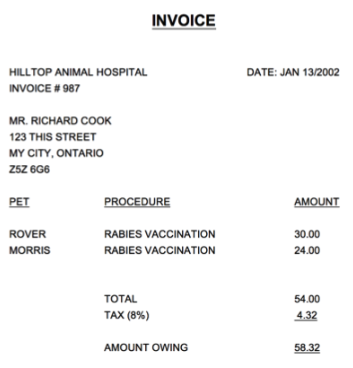

# Example 1

Consider the following relation to answer the questions that follows. 


a) The relation is NOT in 1NF. Why? 
 
b) Normalize the relation to 1NF. 

# Example 2

Consider the following relation to answer the questions that follows. 


a) The relation is NOT in 2NF. Why? 
 
b) Normalize the relation to 2NF, showing the (partial) functional dependencies to the key. 

# Example 3

Consider the following relation to answer the questions that follows. 


a) Normalize the relation to 1NF. 

b) Normalize the relation to 2NF. 

# Example 4

Consider the following invoice.



From the invoice, we can derive the following unnormalized (UNF) relation: 	


Normalize the invoice relation to 3NF.  Assume, based on the previous exercise, that each pet can be uniquely identified by an ID and that each procedure also has an unique ID. Also, consider adding an ID to uniquely identify a customer, pet and procedure. 


Solution:
```
# -> means determines(?)
key is: {num, petName, description}
num -> date, custName custAddress (2NF violation)

After 2NF :
InvoiceDetails(num*, petName*, description, amt)
Invoices(num*, date, custName, custAddress)

custName -> custAddress (3NF violation)

After 3NF:
InvoiceDetails(num*, petName*, description, amt)
Invoices(num*, date, custName, custAddress)
Customers(custName*, custAddress)

Improvement #1:
Break description into code and description
code -> description (2NF violation)

After 2NF: 
InvoiceDetails(num*, petName*, description, code*, amt)
Procedures(code*, description)
Invoices(num*, date, custName, custAddress)

After 3NF:
InvoiceDetails(num*, petName*, description, code*, amt)
Procedures(code*, description)
Invoices(num*, date, custName)
Customers(custName*, custAddress)

Improvement #2:
Add custEmail

After 2NF: 
InvoiceDetails(num*, petName*, description, code*, amt)
Procedures(code*, description)
Invoices(num*, date, custEmail, custName, custAddress)

custEmail -> custName, custAddress (3NF violation)

After 3NF:
InvoiceDetails(num*, petName*, description, code*, amt)
Procedures(code*, description)
Invoices(num*, date, custEmail)
Customers(custEmail*, custName, custAddress)


Exercise: how would your model change if you have invoice number unique?
Answer: We would not have to

```
 


